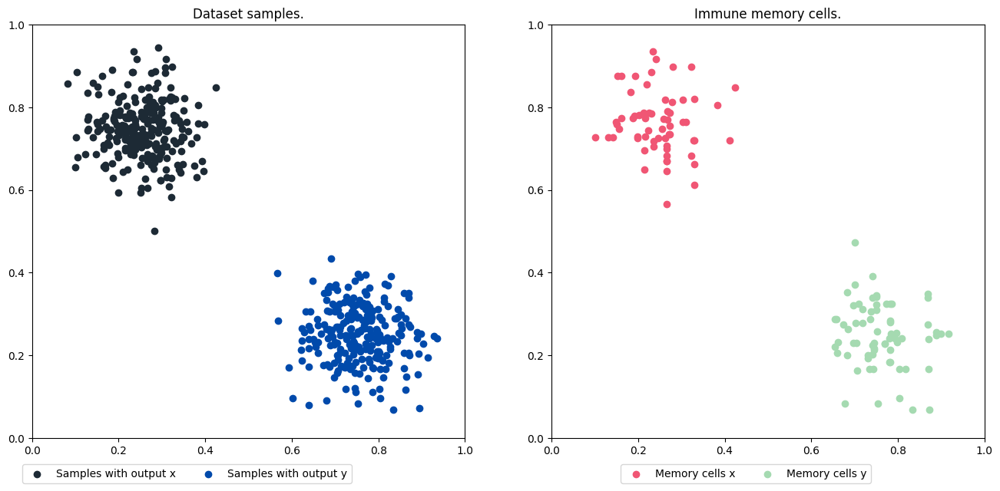

# Using the AIRS

Access the Jupyter notebook with the code available [here](https://github.com/AIS-Package/aisp/blob/main/examples/en/classification/AIRS/example_with_randomly_generated_dataset-en.ipynb)!

### Importing the Artificial Immune Recognition System
```python
from aisp.csa import AIRS
```

### Generating dice bubbles for classes randomly.

Using the `make_blobs` function, two sets of data are generated in the form of bubbles, in the range between 0 and 1, representing each class x and y. Then this data is separated into test and training sets.

```python
from sklearn.datasets import make_blobs
from sklearn.model_selection import train_test_split

# Generating the samples and outputs for the training.
samples, output = make_blobs(n_samples=500 , n_features=2, cluster_std=0.07, center_box=([0.0, 1.0]), centers=[[0.25, 0.75], [0.75, 0.25]], random_state=1234) 
# Separating data for training and testing.
train_x, test_x, train_y, test_y = train_test_split(samples, output, test_size=0.2)
```

---

### Testing the model AIRS:

Then, it presents the result of the forecast accuracy.

```python
from sklearn.metrics import confusion_matrix, classification_report, accuracy_score

# Starting the class.
airs = AIRS(seed=1234)
# Carrying out the training:
airs.fit(X=train_x, y=train_y)
# Previewing classes with test samples.
prev_y = airs.predict(test_x)
# Showing the accuracy of predictions for data.
print(f"The accuracy is {accuracy_score(prev_y, test_y)}")
print(classification_report(test_y, prev_y))
```

Output:
```bash
✔ Set of memory cells for classes (0, 1) successfully generated:  ┇██████████┇ 400/400 memory cells for each aᵢ
The accuracy is 1.0
              precision    recall  f1-score   support

           0       1.00      1.00      1.00        51
           1       1.00      1.00      1.00        49

    accuracy                           1.00       100
   macro avg       1.00      1.00      1.00       100
weighted avg       1.00      1.00      1.00       100
```

---

### Memory cell and sample plotting:

