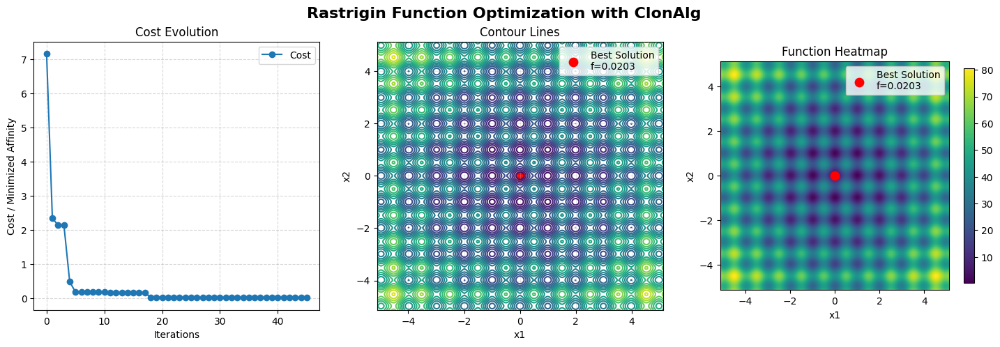

Access the Jupyter notebook with the code available [here](https://github.com/AIS-Package/aisp/blob/main/examples/en/optimization/clonalg/rastrigin_function_example.ipynb)!

Run notebook online via Binder: [](https://mybinder.org/v2/gh/AIS-Package/aisp/HEAD?urlpath=%2Fdoc%2Ftree%2F%2Fexamples%2Fen%2Foptimization%2Fclonalg%2Frastrigin_function_example.ipynb)

### Clonalg to the Rastrigin Function

The Rastrigin function is a multimodal, non-convex function with many local minima, making it an excellent benchmark for optimization algorithms, [learn more](https://en.wikipedia.org/wiki/Rastrigin_function). The function is defined as:

$$ f(x) = 10n + \sum_{i=1}^{n} (x_i^{2} - 10\cos(2\pi x_i)) $$

Where:
* **n** is the problem dimension
* **xᵢ** ∈ \[−5.12, 5.12] for each dimension
* **Global minimum**: f(0,0) = 0

### Import of the required libraries

```python
# Importing the Clonal Selection Algorithm (CLONALG)
from aisp.csa import Clonalg

# Libraries for data manipulation and numerical calculations
import numpy as np

# Data visualization
import matplotlib.pyplot as plt
```

### Problem Definition

```python
problem_size = 2
bounds = {'low': -5.12, 'high': 5.12}

def rastrigin_fitness(x: np.ndarray) -> float:
    x = np.clip(x, bounds['low'], bounds['high'])
    
    n = len(x)
    result = 10 * n
    for i in range(n):
        result += x[i]**2 - 10 * np.cos(2 * np.pi * x[i])
    return result
```

### Algorithm configuration

```python
# Optimized Clonalg configuration for Rastrigin function
clonalg = Clonalg(
    problem_size=problem_size,
    N=50,
    selection_size=15,
    rate_clonal=10,
    rate_hypermutation=0.3,
    n_diversity_injection=15,
    bounds=bounds,
    seed=1234
)

# Register the fitness function
clonalg.register('affinity_function', rastrigin_fitness)
```

### Running the optimization

```python
clonalg.optimize(100, 3)

if clonalg.best_cost is not None:
	print('Best cost:', abs(clonalg.best_cost))
```
Output:
```bash
┌───────────┬─────────────────────────┬────────────────────┬─────────────────┐
│ Iteration │   Best Affinity (min)   │   Worse Affinity   │   Stagnation    │
├───────────┼─────────────────────────┼────────────────────┼─────────────────┤
│     1     │                 7.153385│           76.021342│        0        │
│     2     │                 0.000000│           33.315827│        0        │
│     3     │                 0.000000│           30.948129│        1        │
│     4     │                 0.000000│           31.998642│        2        │
│     5     │                 0.000000│           56.071764│        3        │
└───────────┴─────────────────────────┴────────────────────┴─────────────────┘
Total time: 0.027838 seconds
Best cost: 0.0
```

### Result
```python
print(clonalg.get_report())
```
Output:
```python
=============================================
            Optimization Summary             
=============================================
Best cost      : 0.0
Best solution  : [6.23054972e-307 7.56593696e-307]
Cost History per Iteration:

┌────────────┬────────────────────────────┐
│ Iteration  │            Cost            │
├────────────┼────────────────────────────┤
│          1 │                   7.153385 │
│          2 │                   0.000000 │
│          3 │                   0.000000 │
│          4 │                   0.000000 │
│          5 │                   0.000000 │
└────────────┴────────────────────────────┘
```

### Evolution of the best over generations

