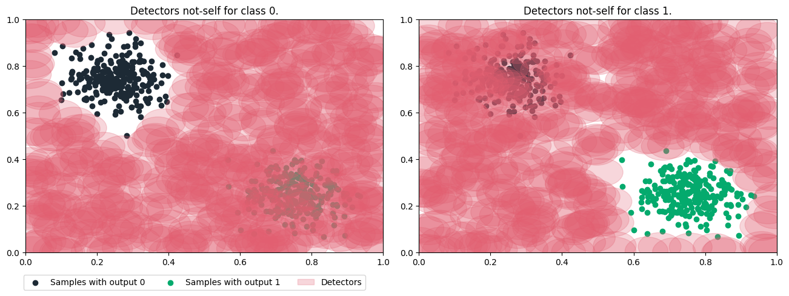

# Artificial Immune Systems Package.

<div style={{ display: "flex", justifyContent: "center", alignItems: "center"}}>

  

</div>

---

## Summary:

> 1. [Introduction.](#introduction)
> 2. [Installation.](#installation)
>    1. [Dependencies](#dependencies)
>    2. [User installation](#user-installation)
>    3. [How to import the Techniques](#how-to-import-the-techniques)
> 3. [Examples.](#examples)
> 4. [Project documentation.](./aisp-techniques/)

## Introduction

The **AISP** is a python module that implements artificial immune systems techniques, distributed under the GNU Lesser General Public License v3.0 (LGPLv3).

The package started in **2022** as a research project at the Federal Institute of Northern Minas Gerais - Salinas campus (**IFNMG - Salinas**).


Artificial Immune Systems (AIS) are inspired by the vertebrate immune system, creating metaphors that apply the ability to detect and catalog pathogens, among other features of this system.

### Algorithms implemented:

> - [x] [**Negative Selection.**](./aisp-techniques/Negative%20Selection/)
> - [ ] *Dendritic Cells.*
> - [ ] *Clonalg.*
> - [ ] *Immune Network Theory.*

## **Installation**

The module requires installation of [python 3.8.10](https://www.python.org/downloads/) or higher.

### **Dependencies:**

<div style={{ display: "flex", justifyContent: "center", alignItems: "center", margin: "auto" }}>

|    Packages   |     Version   |
|:-------------:|:-------------:|
|    numpy      |    ≥ 1.23.0   |
|    scipy      |    ≥ 1.8.1    |
|    tqdm       |    ≥ 4.64.1   |

</div>

### **User installation**

The simplest way to install AISP is using ``pip``:

```bash
pip install aisp
```

### **How to import the Techniques**

```python
from aisp.NSA import RNSA

nsa = RNSA(N=300, r=0.05)
```

## Examples

### Example using the negative selection technique (**nsa**):

In the example present in this [notebook](https://github.com/AIS-Package/aisp/blob/main/examples/RNSA/example_with_randomly_generated_dataset-en.ipynb), **500** random samples were generated, arranged in two groups, one for each class, we can see the non-self detectors generated below:



Below are some examples that use a database for classification with the [Jupyter notebook](https://jupyter.org/) tool.

### **Negative Selection:**

+ Application of negative selection techniques for classification using the Iris family flower database and Old Faithful Geyser:
    + [iris_dataBase_example](https://github.com/AIS-Package/aisp/blob/main/examples/RNSA/iris_dataBase_example_en.ipynb)
    + [geyser_dataBase_example](https://github.com/AIS-Package/aisp/blob/main/examples/RNSA/geyser_dataBase_example_en.ipynb)
+ BNSA - Binary Negative Selection Algorithm: 
    + [mushrooms_dataBase_example](https://github.com/AIS-Package/aisp/blob/main/examples/BNSA/mushrooms_dataBase_example_en.ipynb)