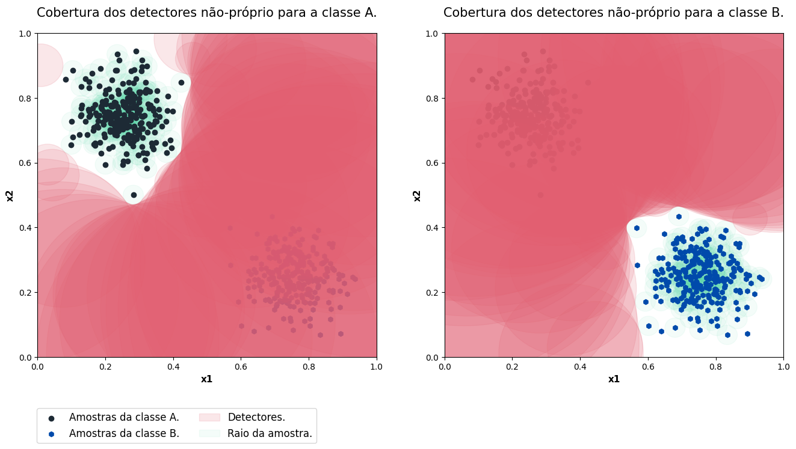

# Utilização básica

## BNSA (Algoritmo de seleção negativa binária)

### Importando o binário de seleção negativa.

```python
from aisp.NSA import BNSA
```
### Gerando anostras binárias aleatoriamente e separando os dados.
#### Função para gerar amostras binárias

Nesta função, são geradas amostras de dados binários com um grau de similaridade acima de um limiar definido s. No entanto, 10% dos primeiros dados são gerados aleatoriamente, sem levar em consideração o valor de s. Além disso, quando já existem amostras, são geradas amostras únicas para a nova classe, garantindo que as amostras aleatórias geradas não estejam duplicadas em classes diferentes.

```python
import numpy as np
from scipy.spatial.distance import cdist
# Essa função gera amostras com similaridades acima de um limiar de semelhança.
def generate_samples(n_samples: int, n_features: int, s: float, x: None):
  classe_samples = []
  while len(classe_samples) < n_samples:
    similarity = 0
    sample_rand = np.random.randint(0, 2, size=(n_features))
    if(len(classe_samples) > max(int(n_samples * 0.1), 1)):
      similarity = cdist(classe_samples, np.expand_dims(sample_rand, axis=0), metric='hamming')[0, :]
      if x is not None:
        if similarity[0] > s and not np.any(np.all(sample_rand == x, axis=1)):
          classe_samples.append(sample_rand)
      elif similarity[0] > s:
        classe_samples.append(sample_rand)
    else:
      classe_samples.append(sample_rand)
  return np.array(classe_samples)
```

#### Geração e separação de dados

Nessa etapa, são gerados 600 dados, sendo 300 para representar a classe 'x' e 300 para representar a classe 'y'. Cada dado é formado por 20 dimensões. É importante destacar que esses dados são criados de forma que apresentem um grau de similaridade de 70%, ou seja, compartilham características comuns. Após a geração, os dados são separados em conjuntos de treinamento e teste.

```python

# Configurando a seed para 121 para garantir a reprodutibilidade dos dados gerados.
np.random.seed(121)
# Gerando amostras para a classe "x".
x = generate_samples(300, 20, 0.7, None)
# Gerando amostras exclusivas para a classe "y", diferentes das amostras presentes na classe "x".
y = generate_samples(300, 20, 0.7, x)
# Adicionando colunas contendo as saídas (rótulos) das classes "x" e "y".
x = np.hstack((x, np.full((x.shape[0], 1), 'x')))
y = np.hstack((y, np.full((y.shape[0], 1), 'y')))
# Juntando os dois vetores (classes "x" e "y") e randomizando a ordem das amostras.
index = np.random.permutation(x.shape[0]*2)
dataset = np.vstack((x, y))[index]
# Separando as características (inputs) e as classes de saída (rótulos).
samples = dataset[:, :-1].astype(int)
output = dataset[:, -1]
# Separação de dados para treinamento e teste.
train_x, test_x, train_y, test_y = train_test_split(samples, output, test_size=0.2)

```
### Testando o modelo:

```python
# Iniciando o modelo.
nsa = BNSA(N=100, aff_thresh=0.3, seed=12321, max_discards=10000)
# Realização do treinamento:
nsa.fit(X=train_x, y=train_y)
# Visualização de classes com amostras de teste.
prev_y = nsa.predict(test_x)
# Mostrando a precisão das previsões para dados reais.
print(f"The accuracy is {accuracy_score(prev_y, test_y)}")
print(classification_report(test_y, prev_y))
```

Output:
```
✔ Non-self detectors for classes (x, y) successfully generated:  ┇██████████┇ 200/200 detectors
A acurácia é 0.9
              precision    recall  f1-score   support

           x       0.91      0.91      0.91        68
           y       0.88      0.88      0.88        52

    accuracy                           0.90       120
   macro avg       0.90      0.90      0.90       120
weighted avg       0.90      0.90      0.90       120
```
## RNSA (Algoritmo de seleção negativa de valor real)

### Importando a seleção negativa com valor real.
```python
from aisp.NSA import RNSA
```

### Gerando bolhas de classe aleatoriamente e separando os dados.

```python
from sklearn.datasets import make_blobs
from sklearn.model_selection import train_test_split

# Gerando as amostras e saídas para o treinamento.
samples, output = make_blobs(n_samples=500 , n_features=2, cluster_std=0.07, center_box=([0.0, 1.0]), centers=[[0.25, 0.75], [0.75, 0.25]], random_state=1234) 
# Separando dados para treinamento e teste.
train_x, test_x, train_y, test_y = train_test_split(samples, output, test_size=0.2)
```

### Testando o modelo `default-NSA`:
```python
from sklearn.metrics import confusion_matrix, classification_report, accuracy_score

# Iniciando a classe.
model = RNSA(N=500, r=0.06, seed=123)
# Efetuando o treinamento: 
model.fit(X=train_x, y=train_y)
# Efetuando a previsão:
prev_y = model.predict(test_x)
# Mostrando a acurácia das previsões para os dados reais.
print(f"The accuracy is {accuracy_score(prev_y, test_y)}")
print(classification_report(test_y, prev_y))
```

Output:
```bash
✔ Non-self detectors for classes (0, 1) successfully generated:  ┇██████████┇ 1000/1000 detectors
The accuracy is 1.0
              precision    recall  f1-score   support

           0       1.00      1.00      1.00        55
           1       1.00      1.00      1.00        45

    accuracy                           1.00       100
   macro avg       1.00      1.00      1.00       100
weighted avg       1.00      1.00      1.00       100
```

### Plotagem dos detector e amostras:


### Testando o modelo `V-detector`:
```python
from sklearn.metrics import confusion_matrix, classification_report, accuracy_score

# Iniciando a classe.
model = RNSA(N=50, r=0.05, algorithm='V-detector', r_s=0.04, seed=1234)
# Efetuando o treinamento: 
model.fit(X=train_x, y=train_y)
# Efetuando a previsão:
prev_y = model.predict(test_x)
# Mostrando a acurácia das previsões para os dados reais.
print(f"A acuracia é {accuracy_score(prev, test_y)}")
print(classification_report(test_y, prev))
```

Output:
```bash
✔ Non-self detectors for classes (0, 1) successfully generated:  ┇██████████┇ 100/100 detectors
A acuracia é 1.0
              precision    recall  f1-score   support

           0       1.00      1.00      1.00        48
           1       1.00      1.00      1.00        52

    accuracy                           1.00       100
   macro avg       1.00      1.00      1.00       100
weighted avg       1.00      1.00      1.00       100
```

### Plotagem dos detector e amostras:

