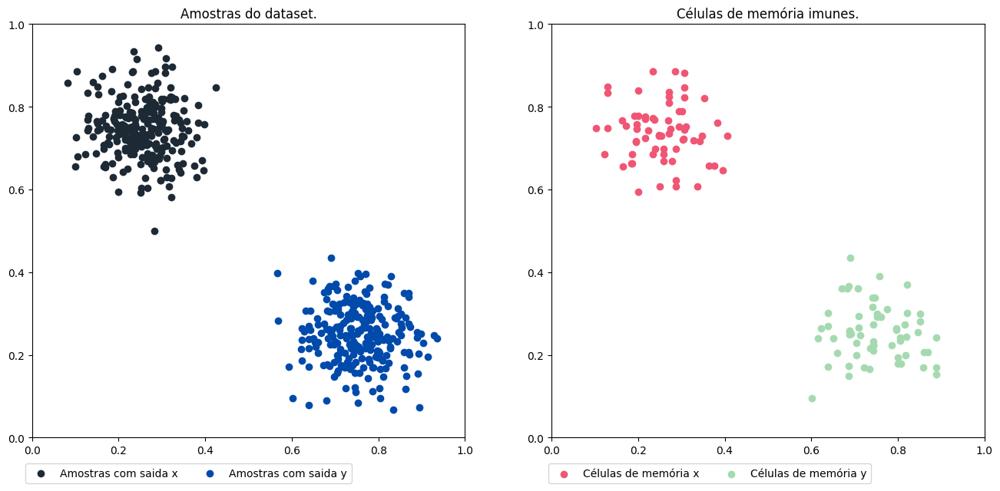

# Usando o AIRS

Acesse o notebook Jupyter com o código disponível [aqui](https://github.com/AIS-Package/aisp/blob/main/examples/pt-br/classification/AIRS/example_with_randomly_generated_dataset-en.ipynb)!

### Importação do Sistema de Reconhecimento Imunológico Artificial
```python
from aisp.csa import AIRS
```

### Gerando bolhas de dados para as classe aleatoriamente.

Utilizando a função make_blobs, são gerados dois conjuntos de dados em forma de bolhas, no intervalo entre 0 e 1, representando cada classe x e y. Em seguida, esses dados são separados em conjuntos de teste e treinamento.

```python
from sklearn.datasets import make_blobs
from sklearn.model_selection import train_test_split

# Gerando as amostras e saídas para o treinamento.
samples, output = make_blobs(
    n_samples=500,
    cluster_std=0.07,
    center_box=(0.0, 1.0),
    centers=[[0.25, 0.75], [0.75, 0.25]],
    random_state=1234,
)
# Separando dados para treinamento e teste.
train_x, test_x, train_y, test_y = train_test_split(samples, output, test_size=0.2)
```

---

### Testing the model AIRS:

Em seguida, apresenta o resultado da acurácia da previsão.

```python
from sklearn.metrics import confusion_matrix, classification_report, accuracy_score


# Iniciando a classe.
airs = AIRS(seed=1234)
# Efetuando o treinamento: 
airs.fit(X=train_x, y=train_y)
# Efetuando a previsão:: 
prev = airs.predict(X=test_x)
# Mostrando a acurácia das previsões para os dados.
print(f"A acurácia é {accuracy_score(prev, test_y)}")
print(classification_report(test_y, prev))
```

Output:
```bash
✔ Set of memory cells for classes (0, 1) successfully generated:  ┇██████████┇ 400/400 memory cells for each aᵢ
A acurácia é 1.0
              precision    recall  f1-score   support

           0       1.00      1.00      1.00        48
           1       1.00      1.00      1.00        52

    accuracy                           1.00       100
   macro avg       1.00      1.00      1.00       100
weighted avg       1.00      1.00      1.00       100
```

---

### Célula de memória e plotagem de amostra:

