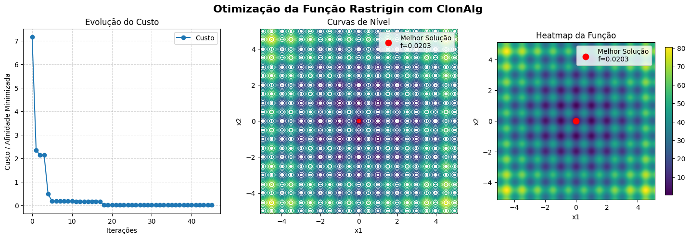

Acesse o notebook Jupyter com o código disponível [here](https://github.com/AIS-Package/aisp/blob/main/examples/pt-br/optimization/clonalg/rastrigin_function_example.ipynb)!

Executar o notebook online via Binder: [](https://mybinder.org/v2/gh/AIS-Package/aisp/HEAD?urlpath=%2Fdoc%2Ftree%2F%2Fexamples%2Fpt-br%2Foptimization%2Fclonalg%2Frastrigin_function_example.ipynb)

### Aplicamos o Clonalg à Função Rastrigin.

A função Rastrigin é uma função multimodal não-convexa que possui muitos mínimos locais, 
tornando-a um excelente teste para algoritmos de otimização, [saiba mais](https://en.wikipedia.org/wiki/Rastrigin_function). A função é definida como:

$$ f(x) = 10n + \sum_{i=1}^{n} (x_i^{2} - 10\cos(2\pi x_i)) $$

Onde:
* **n** é a dimensão do problema
* **x_i** ∈ [-5.12, 5.12] para cada dimensão
* **Mínimo global**: f(0,0) = 0

### Importação das bibliotecas necessárias

```python
# Importando o Algoritmo de Seleção Clonal (CLONALG)
from aisp.csa import Clonalg

# Bibliotecas para manipulação de dados e cálculos numéricos
import numpy as np

# Visualização de dados
import matplotlib.pyplot as plt
```

### Definição do problema

```python
problem_size = 2
bounds = {'low': -5.12, 'high': 5.12}

def rastrigin_fitness(x: np.ndarray) -> float:
    x = np.clip(x, bounds['low'], bounds['high'])
    
    n = len(x)
    result = 10 * n
    for i in range(n):
        result += x[i]**2 - 10 * np.cos(2 * np.pi * x[i])
    return result
```

### Configuração do algoritmo

```python
# Configuração otimizada do Clonalg para função Rastrigin
clonalg = Clonalg(
    problem_size=problem_size,
    N=50,
    selection_size=15,
    rate_clonal=10,
    rate_hypermutation=0.3,
    n_diversity_injection=15,
    bounds=bounds,
    seed=1234
)

# Registrar a função de fitness
clonalg.register('affinity_function', rastrigin_fitness)
```

### Execução da otimização

```python
clonalg.optimize(100, 20)

if clonalg.best_cost is not None:
    print('Best cost:', abs(clonalg.best_cost))
```
Output:
```bash
┌───────────┬─────────────────────────┬────────────────────┬─────────────────┐
│ Iteration │   Best Affinity (min)   │   Worse Affinity   │   Stagnation    │
├───────────┼─────────────────────────┼────────────────────┼─────────────────┤
│     1     │                 7.153385│           76.021342│        0        │
│     2     │                 2.344533│           33.315827│        0        │
│     3     │                 2.140116│           30.948129│        0        │
│     4     │                 2.140116│           31.998642│        1        │
│     5     │                 0.484366│           56.071764│        0        │
│     6     │                 0.185833│           36.260411│        0        │
│     7     │                 0.185833│           27.861454│        1        │
│     8     │                 0.185833│           29.599095│        2        │
│     9     │                 0.185833│           17.182111│        3        │
│    10     │                 0.185833│           18.465362│        4        │
│    11     │                 0.185833│           56.496717│        5        │
│    12     │                 0.161393│           33.675148│        0        │
│    13     │                 0.161393│           22.855341│        1        │
│    14     │                 0.161393│           71.552278│        2        │
│    15     │                 0.161393│           43.872058│        3        │
│    16     │                 0.161393│           28.045742│        4        │
│    17     │                 0.161393│           46.444268│        5        │
│    18     │                 0.161393│           28.197926│        6        │
│    19     │                 0.030122│           32.764169│        0        │
│    20     │                 0.030122│           27.485715│        1        │
│    21     │                 0.030122│           17.547005│        2        │
│    22     │                 0.030122│           43.293872│        3        │
│    23     │                 0.030122│           43.366562│        4        │
│    24     │                 0.030122│           42.037080│        5        │
│    25     │                 0.030122│           28.196466│        6        │
│    26     │                 0.020278│           37.645191│        0        │
│    27     │                 0.020278│           28.413549│        1        │
│    28     │                 0.020278│           32.007209│        2        │
│    29     │                 0.020278│           45.392869│        3        │
│    30     │                 0.020278│           15.223606│        4        │
│    31     │                 0.020278│           46.298146│        5        │
│    32     │                 0.020278│           21.641321│        6        │
│    33     │                 0.020278│           47.343886│        7        │
│    34     │                 0.020278│           20.720949│        8        │
│    35     │                 0.020278│           31.158014│        9        │
│    36     │                 0.020278│           42.655313│       10        │
│    37     │                 0.020278│           28.978964│       11        │
│    38     │                 0.020278│           27.926847│       12        │
│    39     │                 0.020278│           22.639969│       13        │
│    40     │                 0.020278│           43.618425│       14        │
│    41     │                 0.020278│           28.637045│       15        │
│    42     │                 0.020278│           36.324186│       16        │
│    43     │                 0.020278│           58.068571│       17        │
│    44     │                 0.020278│           61.189833│       18        │
│    45     │                 0.020278│           26.157713│       19        │
│    46     │                 0.020278│           49.301933│       20        │
└───────────┴─────────────────────────┴────────────────────┴─────────────────┘
Total time: 0.107499 seconds
Best cost: 0.020278270044883584
```

### Resultado

```python
print(clonalg.get_report())
```
Output:
```python
=============================================
            Optimization Summary             
=============================================
Best cost      : 0.020278270044883584
Best solution  : [ 0.0088594  -0.00487301]
Cost History per Iteration:

┌────────────┬────────────────────────────┐
│ Iteration  │            Cost            │
├────────────┼────────────────────────────┤
│          1 │                   7.153385 │
│          2 │                   2.344533 │
│          3 │                   2.140116 │
│          4 │                   2.140116 │
│          5 │                   0.484366 │
│          6 │                   0.185833 │
│          7 │                   0.185833 │
│          8 │                   0.185833 │
│          9 │                   0.185833 │
│         10 │                   0.185833 │
│         11 │                   0.185833 │
│         12 │                   0.161393 │
│         13 │                   0.161393 │
│         14 │                   0.161393 │
│         15 │                   0.161393 │
│         16 │                   0.161393 │
│         17 │                   0.161393 │
│         18 │                   0.161393 │
│         19 │                   0.030122 │
│         20 │                   0.030122 │
│         21 │                   0.030122 │
│         22 │                   0.030122 │
│         23 │                   0.030122 │
│         24 │                   0.030122 │
│         25 │                   0.030122 │
│         26 │                   0.020278 │
│         27 │                   0.020278 │
│         28 │                   0.020278 │
│         29 │                   0.020278 │
│         30 │                   0.020278 │
│         31 │                   0.020278 │
│         32 │                   0.020278 │
│         33 │                   0.020278 │
│         34 │                   0.020278 │
│         35 │                   0.020278 │
│         36 │                   0.020278 │
│         37 │                   0.020278 │
│         38 │                   0.020278 │
│         39 │                   0.020278 │
│         40 │                   0.020278 │
│         41 │                   0.020278 │
│         42 │                   0.020278 │
│         43 │                   0.020278 │
│         44 │                   0.020278 │
│         45 │                   0.020278 │
│         46 │                   0.020278 │
└────────────┴────────────────────────────┘
```

### Evolução do melhor ao longo das gerações

