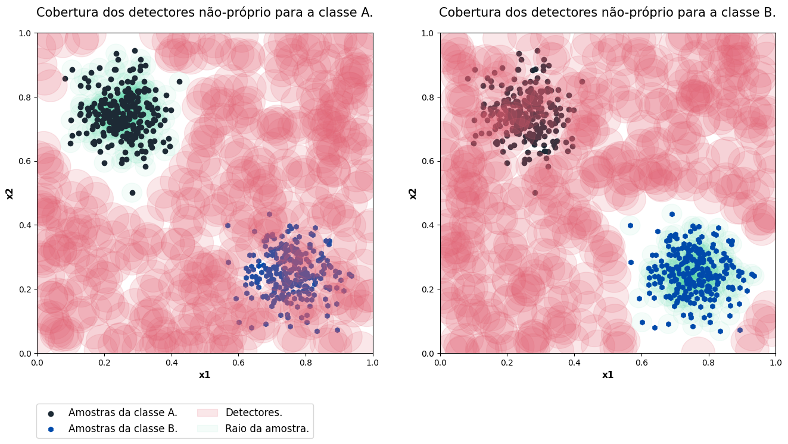

# Usando o RNSA

Acesse o notebook Jupyter com o código disponível [aqui](https://github.com/AIS-Package/aisp/blob/main/examples/pt-br/classification/RNSA/example_with_randomly_generated_dataset-pt.ipynb)!

Executar o notebook online via Binder:  [](https://mybinder.org/v2/gh/AIS-Package/aisp/HEAD?labpath=%2Fexamples%2Fpt-br%2Fclassification%2FRNSA%2Fexample_with_randomly_generated_dataset-pt.ipynb)

## Importando o Algoritmo de seleção negativa de valor real

```python
from aisp.nsa import RNSA
```

## Gerando bolhas de dados para as classe aleatoriamente

Utilizando a função make_blobs, são gerados dois conjuntos de dados em forma de bolhas, no intervalo entre 0 e 1, representando cada classe x e y. Em seguida, esses dados são separados em conjuntos de teste e treinamento.

```python
from sklearn.datasets import make_blobs
from sklearn.model_selection import train_test_split

# Gerando as amostras e saídas para o treinamento.
samples, output = make_blobs(n_samples=500 , n_features=2, cluster_std=0.07, center_box=([0.0, 1.0]), centers=[[0.25, 0.75], [0.75, 0.25]], random_state=1234) 
# Separando dados para treinamento e teste.
train_x, test_x, train_y, test_y = train_test_split(samples, output, test_size=0.2)
```

---

## Testando o modelo `default-NSA`

Inicia o modelo com 500 detectores, cada um com um raio de 0.06. Em seguida, apresenta o resultado da acurácia da previsão.

```python
from sklearn.metrics import confusion_matrix, classification_report, accuracy_score

# Iniciando a classe.
model = RNSA(N=500, r=0.05, r_s=0.03, seed=1234)
# Efetuando o treinamento: 
model.fit(X=train_x, y=train_y)
# Efetuando a previsão:
prev_y = model.predict(test_x)
# Mostrando a acurácia das previsões para os dados reais.
print(f"The accuracy is {accuracy_score(prev_y, test_y)}")
print(classification_report(test_y, prev_y))
```

Output:

```bash
✔ Non-self detectors for classes (0, 1) successfully generated:  ┇██████████┇ 1000/1000 detectors
The accuracy is 1.0
              precision    recall  f1-score   support

           0       1.00      1.00      1.00        55
           1       1.00      1.00      1.00        45

    accuracy                           1.00       100
   macro avg       1.00      1.00      1.00       100
weighted avg       1.00      1.00      1.00       100
```

---

## Plotagem dos detector e amostras



---

## Testando o modelo `V-detector`

Inicia o modelo com 50 detectores, onde o raio mínimo é de 0.05 e o raio próprio das amostras é de 0.04. Em seguida, mostra o resultado da acurácia da previsão.

```python
from sklearn.metrics import confusion_matrix, classification_report, accuracy_score

# Iniciando a classe.
model = RNSA(N=50, r=0.05, algorithm="V-detector", r_s=0.03, seed=1234)
# Efetuando o treinamento: 
model.fit(X=train_x, y=train_y)
# Efetuando a previsão:
prev_y = model.predict(test_x)
# Mostrando a acurácia das previsões para os dados reais.
print(f"A acuracia é {accuracy_score(prev, test_y)}")
print(classification_report(test_y, prev))
```

Output:

```bash
✔ Non-self detectors for classes (0, 1) successfully generated:  ┇██████████┇ 100/100 detectors
A acuracia é 1.0
              precision    recall  f1-score   support

           0       1.00      1.00      1.00        48
           1       1.00      1.00      1.00        52

    accuracy                           1.00       100
   macro avg       1.00      1.00      1.00       100
weighted avg       1.00      1.00      1.00       100
```

---

## Plotagem dos v-detector e amostras


