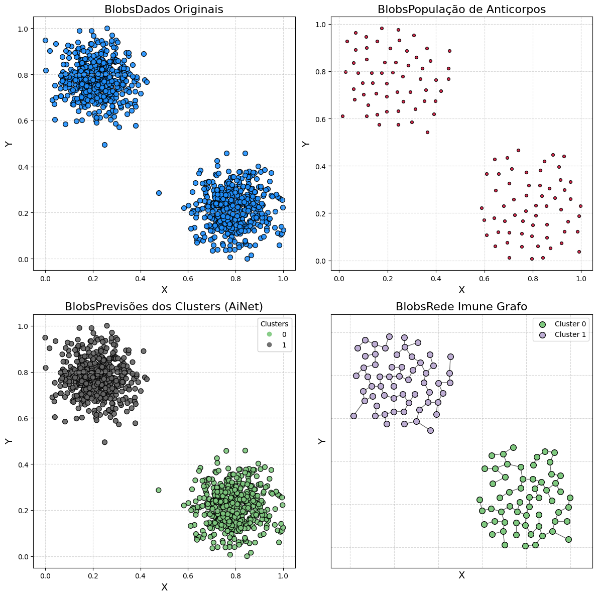
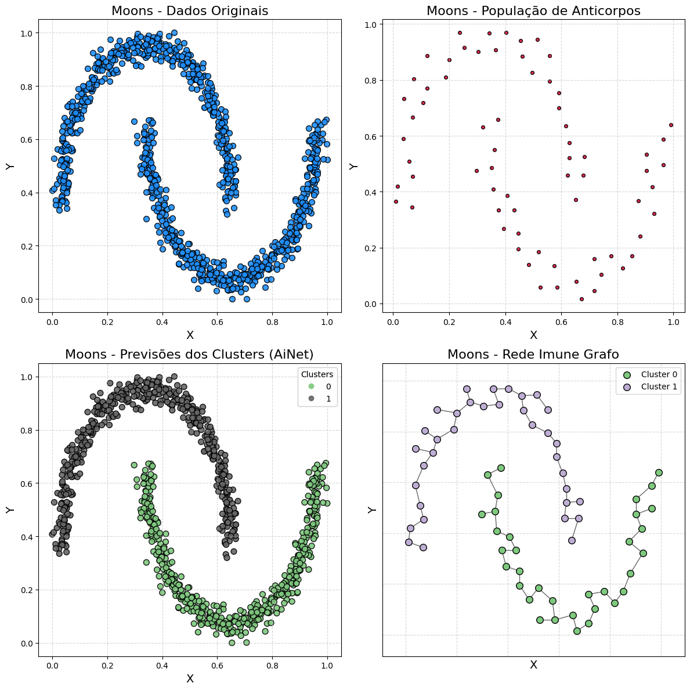
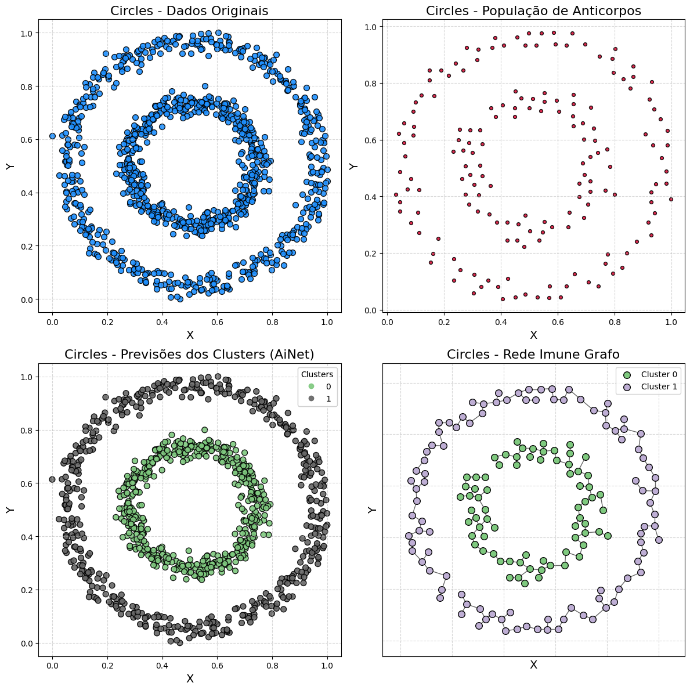

# Usando o AiNet
Acesse o Jupyter Notebook com o código disponível [aqui](https://github.com/AIS-Package/aisp/blob/main/examples/pt-br/clustering/AiNet/example_with_randomly_generated_dataset.ipynb)!

Execute o notebook online via Binder: [](https://mybinder.org/v2/gh/AIS-Package/aisp/HEAD?labpath=%2Fexamples%2Fpt-br%2Fclustering%2FAiNet%2Fexample_with_randomly_generated_dataset.ipynb)
## Introdução

A clusterização é uma tarefa de aprendizado de máquina não supervisionado que visa agrupar um conjunto de dados no mesmo grupo (chamado de cluster).

Neste notebook, exploraremos o AiNet (Artificial Immune Network). O AiNet utiliza conceitos como afinidade de anticorpos e supressão de clones para identificar os centros dos clusters nos dados.

Objetivo: O objetivo é demonstrar a eficácia do AiNet na clusterização dos conjuntos de dados random:

* **Blobs:** Clusters bem definidos e esféricos.
* **Moons:** Clusters com uma forma não linear.
* **Circles:** Clusters dispostos em dois círculos concêntricos, apresentando separação não linear.

**Estrutura do Notebook:**

* **Configuração:** Instalação e importação das bibliotecas necessárias.
* **Função de Visualização:** Definição de uma função para plotar os resultados.
* **Demonstração 1** - Dataset Blobs: Aplicação do AiNet ao blobs.
* **Demonstração 2** - Dataset Moons: Aplicação do AiNet ao moons.
* **Demonstração 3** - Dataset Circles: Aplicação do AiNet ao circles.

---

## Importando a Rede Imune Artificial
```python
from aisp.ina import AiNet
```

---

## Função de Visualização

<details>
<summary>Função de Visualização do AiNet (plota agrupamentos e a rede imune)</summary>

```python
def plot_immune_network(train_x, predict_y, model, title_prefix=""):
    """
    Plota os resultados da clusterização da AiNet.

    Paramentos:
        train_x (np.array): Os dados de entrada.
        predict_y (np.array): As previsões de cluster do modelo.
        model (AiNet): O modelo AiNet treinado.
        title_prefix (str, optional): Um prefixo para os títulos dos gráficos.
    """
    clusters = list(model._memory_network.values())
    network = np.array(model._population_antibodies)
    
    _, axs = plt.subplots(2, 2, figsize=(12, 12))
    colors = colormaps.get_cmap('Accent')

    # Dados originais
    axs[0][0].scatter(train_x[:, 0], train_x[:, 1], color='dodgerblue', alpha=0.9, s=50, marker='o', edgecolors='k')
    axs[0][0].set_title(f'{title_prefix}Dados Originais', fontsize=16)
    axs[0][0].set_xlabel('X', fontsize=14)
    axs[0][0].set_ylabel('Y', fontsize=14)
    axs[0][0].grid(True, linestyle='--', alpha=0.5)

    # População de anticorpos
    axs[0][1].scatter(network[:, 0], network[:, 1], color='crimson', alpha=0.9, s=70, marker='.', edgecolors='k')
    axs[0][1].set_title(f'{title_prefix}População de Anticorpos', fontsize=16)
    axs[0][1].set_xlabel('X', fontsize=14)
    axs[0][1].set_ylabel('Y', fontsize=14)
    axs[0][1].grid(True, linestyle='--', alpha=0.5)

    # Previsões dos clusters
    scatter = axs[1][0].scatter(train_x[:, 0], train_x[:, 1], c=predict_y, cmap='Accent', s=50, edgecolors='k', alpha=0.9)
    axs[1][0].set_title(f'{title_prefix}Previsões dos Clusters (AiNet)', fontsize=16)
    axs[1][0].set_xlabel('X', fontsize=14)
    axs[1][0].set_ylabel('Y', fontsize=14)
    axs[1][0].grid(True, linestyle='--', alpha=0.5)
    legend1 = axs[1][0].legend(*scatter.legend_elements(), title="Clusters")
    axs[1][0].add_artist(legend1)

    # Grafo da Rede Imune
    G = nx.Graph()
    positions = {}
    for i, cluster in enumerate(clusters):
        cluster_nodes = [f'{i}_{j}' for j in range(len(cluster))]
        G.add_nodes_from(cluster_nodes)
        for node, point in zip(cluster_nodes, cluster):
            positions[node] = tuple(point)
        dist_matrix = squareform(pdist(cluster))
        mst_local = minimum_spanning_tree(dist_matrix).toarray()
        for row_idx, row in enumerate(mst_local):
            for col_idx, weight in enumerate(row):
                if weight > 0:
                    G.add_edge(cluster_nodes[row_idx], cluster_nodes[col_idx], weight=weight)
    for i, cluster in enumerate(clusters):
        cluster_nodes = [f'{i}_{j}' for j in range(len(cluster))]
        nx.draw_networkx_nodes(G, positions, nodelist=cluster_nodes, ax=axs[1][1],
                               node_color=[colors(i)], node_size=70, edgecolors='k', label=f'Cluster {i}')
    nx.draw_networkx_edges(G, positions, ax=axs[1][1], alpha=0.6)
    axs[1][1].set_title(f'{title_prefix}Rede Imune Grafo', fontsize=16)
    axs[1][1].set_xlabel('X', fontsize=14)
    axs[1][1].set_ylabel('Y', fontsize=14)
    axs[1][1].grid(True, linestyle='--', alpha=0.5)
    axs[1][1].legend()
    plt.tight_layout()
    plt.show()
```

</details>

---

## Demonstração 1 - Dataset Blobs

### Gerando bolhas de dados

```python
samples, output = make_blobs(
    n_samples=1000,
    cluster_std=0.07,
    center_box=(0.0, 1.0),
    centers=[[0.25, 0.75], [0.75, 0.25]],
    random_state=1234,
)
```

### Treinando o modelo AiNet

```python
model = AiNet(suppression_threshold=0.96, affinity_threshold=0.95, mst_inconsistency_factor=3, seed=123)
predict_y = model.fit_predict(samples)
```

Output:
```bash
✔ Set of memory antibodies for classes (0, 1) successfully generated | Clusters: 2 | Population of antibodies size: 119:  ┇██████████┇ 10/10 total training interactions
```

### Silhouette score

```python
silhouette = silhouette_score(samples, predict_y)
print(f"Coeficiente de Silhueta: {silhouette:.3f}")
```

Output:
```bash
Coeficiente de Silhueta: 0.826
```

### Visualizando os resultados

```python
plot_immune_network(samples, predict_y, model, title_prefix="Blobs - ")
```



---

## Demonstração 2 - Moons Dataset

### Gerando dados em formato de "moons" (luas)

```python
samples, output = make_moons(n_samples=1000, noise=0.05, random_state=42)
samples = MinMaxScaler().fit_transform(samples)
```

### Treinando o AiNet

```python
model = AiNet(suppression_threshold=0.95, affinity_threshold=0.97, mst_inconsistency_factor=2.5, seed=123)
predict_y = model.fit_predict(samples)
```

Output:
```bash
✔ Set of memory antibodies for classes (0, 1) successfully generated | Clusters: 2 | Population of antibodies size: 69:  ┇██████████┇ 10/10 total training interactions
```

### Silhouette score

```python
silhouette = silhouette_score(samples, predict_y)
print(f"Coeficiente de Silhueta: {silhouette:.3f}")
```

Output:
```bash
Coeficiente de Silhueta: 0.398
```

### Visualizando

```python
plot_immune_network(samples, predict_y, model, title_prefix="Moons - ")
```



---

## Demonstração 3 - Circles Dataset

### Gerando dados em formato de círculos concêntricos

```python
samples, output = make_circles(n_samples=1000, noise=0.05, factor=0.5, random_state=42)
samples = MinMaxScaler().fit_transform(samples)
```

### Training AiNet

```python
model = AiNet(suppression_threshold=0.97, affinity_threshold=0.98, mst_inconsistency_factor=3.8, seed=123)
predict_y = model.fit_predict(samples)
```

Output:
```bash
✔ Set of memory antibodies for classes (0, 1) successfully generated | Clusters: 2 | Population of antibodies size: 169:  ┇██████████┇ 10/10 total training interactions
```

### Silhouette score

```python
silhouette = silhouette_score(samples, predict_y)
print(f"Coeficiente de Silhueta: {silhouette:.3f}")
```

Output:
```bash
Coeficiente de Silhueta: 0.112
```
### Visualizando o AiNet nos dados de círculos

```python
plot_immune_network(samples, predict_y, model, title_prefix="Circles - ")
```


