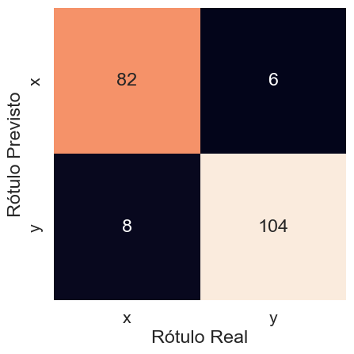

# Usando o BNSA

O presente exemplo, disponível aqui, visa demonstrar a aplicação do algoritmo de seleção negativa binária. Esse algoritmo é empregado na classificação de amostras com características discretas.

Acesse o notebook Jupyter disponível [aqui](https://github.com/AIS-Package/aisp/blob/main/examples/pt-br/classification/BNSA/example_with_randomly_generated_dataset-pt.ipynb)!

Executar o notebook online via Binder:  [](https://mybinder.org/v2/gh/AIS-Package/aisp/HEAD?labpath=%2Fexamples%2Fpt-br%2Fclassification%2FBNSA%2Fexample_with_randomly_generated_dataset-pt.ipynb)

## Importando o algoritmo BNSA

```python
from aisp.nsa import BNSA
```

## Gerando amostras

O treinamento e teste do algoritmo precisa de amostras de dados. Assim, para a demonstração, foram geradas duas classes aleatórias, empregando a função a seguir:

```python
import numpy as np
from scipy.spatial.distance import cdist
# Essa função gera amostras com similaridades acima de um limiar de semelhança.
def generate_samples(n_samples: int, n_features: int, s: float, x: None):
  classe_samples = []
  while len(classe_samples) < n_samples:
    similarity = 0
    sample_rand = np.random.randint(0, 2, size=(n_features))
    if(len(classe_samples) > max(int(n_samples * 0.1), 1)):
      similarity = cdist(classe_samples, np.expand_dims(sample_rand, axis=0), metric='hamming')[0, :]
      if x is not None:
        if similarity[0] <= s and not np.any(np.all(sample_rand == x, axis=1)):
          classe_samples.append(sample_rand)
      elif similarity[0] <= s:
        classe_samples.append(sample_rand)
    else:
      classe_samples.append(sample_rand)
  return np.array(classe_samples)
```

---

Cada classe contará com 500 amostras, sendo a similaridade mínima entre amostras de 80% (s = 0.2). Essas classes serão separadas em conjunto de treinamento (800 amostras) e de teste (200 amostras).

```python
# Configurando a seed para 121 para garantir a reprodutibilidade dos dados gerados.
np.random.seed(121)
# Gerando amostras para a classe "x".
x = generate_samples(500, 20, 0.2, None)
# Gerando amostras exclusivas para a classe "y", diferentes das amostras presentes na classe "x".
y = generate_samples(500, 20, 0.2, x)
# Adicionando colunas contendo as saídas (rótulos) das classes "x" e "y".
x = np.hstack((x, np.full((x.shape[0], 1), 'x')))
y = np.hstack((y, np.full((y.shape[0], 1), 'y')))
# Juntando os dois vetores (classes "x" e "y") e randomizando a ordem das amostras.
index = np.random.permutation(x.shape[0]*2)
dataset = np.vstack((x, y))[index]

# Separando as características (inputs) e as classes de saída (rótulos).
samples = dataset[:, :-1].astype(int)
output = dataset[:, -1]
# Separando as amostras de treinamento e teste
train_x, test_x, train_y, test_y = train_test_split(samples, output, test_size=0.2, random_state=1234321)

```

---

## Treinamento

O modelo é ajustado através dos padrões de treinamento. Nessa aplicação, a seleção negativa distribuirá, com taxa de diferenciação de 30%, 250 detectores pelo espaço de entradas.

```python
# Iniciando p modelo.
nsa = BNSA(N=250, aff_thresh=0.30, seed=1234321, max_discards=10000)
# Efetuando o treinamento: 
nsa.fit(X=train_x, y=train_y)
# Efetuando a previsão:: 
prev = nsa.predict(X=test_x)
# Mostrando a acurácia das previsões para os dados reais.
print(f"A acurácia é {accuracy_score(prev, test_y)}")
print(classification_report(test_y, prev))
```

Output:

```
✔ Non-self detectors for classes (x, y) successfully generated:  ┇██████████┇ 500/500 detectors
A acurácia é 0.93
              precision    recall  f1-score   support

           x       0.93      0.91      0.92        90
           y       0.93      0.95      0.94       110

    accuracy                           0.93       200
   macro avg       0.93      0.93      0.93       200
weighted avg       0.93      0.93      0.93       200
```

---

## Avaliação

O modelo obteve 0,93 de acurácia para o conjunto teste. A precisão na classificação, tanto para x quanto para y, também foi de 0,93. Isso pode ser observado pela matriz de confusão na Figura 1.


