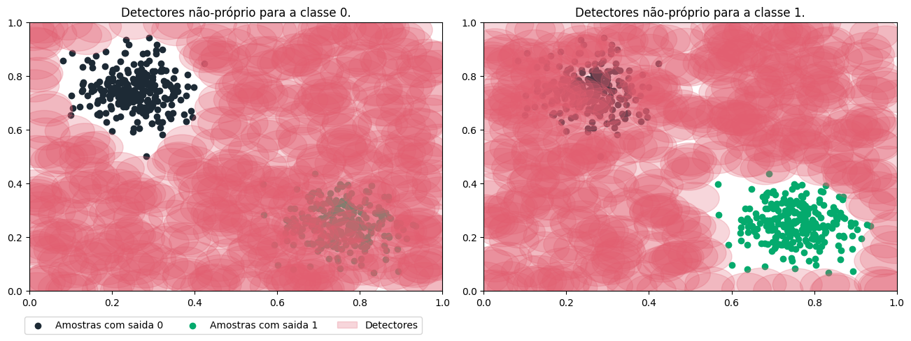

# Pacote de Sistemas Imunológicos Artificiais.
<div style={{ display: "flex", justifyContent: "center", alignItems: "center", margin: "auto" }}>

  

</div>

---

## Sumário:

> 1. [Introdução.](#introdução)
> 2. [Instalação.](#instalação)
>    1. [Dependências](#dependências)
>    2. [Instalação do usuário](#instalação-do-usuário)
>    3. [Como importar as Tecnicas](#como-importar-as-tecnicas)
> 3. [Exemplos.](#exemplos)
> 4. [Documentação do projeto](./aisp-techniques/)

---

## Introdução

O **AISP**, é um módulo python que implementa as técnicas dos sistemas imunológicos artificiais, distribuído sob a licença GNU General Public License v3 (GPLv3).

O pacote teve início no ano de **2022** como um projeto de pesquisa no instituto federal do norte de minas gerais - campus salinas (**IFNMG - Salinas**).

Os sistemas imunológicos artificiais (SIA) inspiram-se no sistema imunológico dos vertebrados, criando metáforas que aplicam a capacidade de reconhecer e catalogar os patógenos, entre outras características desse sistema.

### Algoritmos implementados:

> - [x] [**Seleção Negativa.**](./aisp-techniques/Negative%20Selection/)
> - [ ] *Células Dendríticas.*
> - [ ] *Clonalg.*
> - [ ] *Teoria da Rede Imune.*

## **Instalação**


O módulo requer a instalação do [python 3.8.10](https://www.python.org/downloads/) ou superior.

### **Dependências:**

<div style={{ display: "flex", justifyContent: "center", alignItems: "center", margin: "auto" }}>

|    Pacotes    |     Versão    |
|:-------------:|:-------------:|
|    numpy      |    ≥ 1.23.0   |
|    scipy      |    ≥ 1.8.1    |
|    tqdm       |    ≥ 4.64.1   |

</div>

### **Instalação do usuário**

A maneira mais simples de instalação do AISP é utilizando o ``pip``:

```bash
pip install aisp
```

### **Como importar as Tecnicas**

``` python
from aisp.NSA import RNSA

nsa = RNSA(N=300, r=0.05)
```


## Exemplos:
### Exemplo utilizando a técnica de seleção negativa (**nsa**):

No exemplo presente nesse [notebook](https://github.com/AIS-Package/aisp/examples/RNSA/example_with_randomly_generated_dataset-pt.ipynb), gerou-se **500** amostras aleatórias dispostas em dois grupos um para cada classe, podemos visualizar os detectores do não-próprio gerados abaixo:




---

A seguir alguns exemplos que utiliza-se de base de dados para classificação com a ferramenta [Jupyter notebook](https://jupyter.org/)..

### **Seleção Negativa:**
+ Aplicação das tecnica de seleção negativa para classificação utilizando a base de dados de flores da família Iris e Old Faithful Geyser:
    + [iris_dataBase_example](https://github.com/AIS-Package/aisp/blob/main/examples/RNSA/iris_dataBase_example_pt-br.ipynb)
    + [geyser_dataBase_example](https://github.com/AIS-Package/aisp/blob/main/examples/RNSA/geyser_dataBase_example_pt-br.ipynb)
+ BNSA - Algoritmo de Seleção Negativa Binária: 
    + [mushrooms_dataBase_example](https://github.com/AIS-Package/aisp/blob/main/examples/BNSA/mushrooms_dataBase_example_pt-br.ipynb)