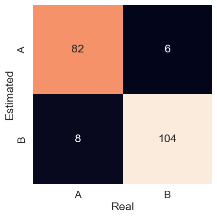

# Applying the BNSA
The present example, available here, aims to demonstrate the application of the binary negative selection algorithm. This algorithm is used to classify samples with discrete characteristics.

Access the Jupyter notebook with the code available [here](https://github.com/AIS-Package/aisp/blob/0.1.x/examples/BNSA/example_with_randomly_generated_dataset-en.ipynb)!

## Importing the BNSA algorithm

```python
from aisp.nsa import BNSA
```
## Generating samples

Algorithm training and testing needs data samples. Thus, for the demonstration, two random classes were generated, using the following function:

```python
import numpy as np
from scipy.spatial.distance import cdist

def generate_samples(n_samples: int, n_features: int, s: float, x: None):
   class_samples = []
   while len(class_samples) < n_samples:
     similarity = 0
     sample_rand = np.random.randint(0, 2, size=(n_features))
     if(len(class_samples) > max(int(n_samples * 0.1), 1)):
       similarity = cdist(class_samples, np.expand_dims(sample_rand, axis=0), metric='hamming')[0, :]
       if x is not None:
         if similarity[0] <= s and not np.any(np.all(sample_rand == x, axis=1)):
           class_samples.append(sample_rand)
       elif similarity[0] <= s:
         class_samples.append(sample_rand)
     else:
       class_samples.append(sample_rand)
   return np.array(class_samples)
```

---

Each class will have 500 samples, with the minimum similarity between samples being 80% (s = 0.2). These classes will be separated into training (800 samples) and testing (200 samples) sets.

```python
from sklearn.model_selection import train_test_split
# Setting the seed to 121 to ensure the reproducibility of the generated data.
np.random.seed(121)
# Generating samples for class "x".
x = generate_samples(500, 20, 0.2, None)
# Generating unique samples for class "y", different from samples present in class "x".
y = generate_samples(500, 20, 0.2, x)
# Adding columns containing the outputs (labels) of classes "x" and "y".
x = np.hstack((x, np.full((x.shape[0], 1), 'x')))
y = np.hstack((y, np.full((y.shape[0], 1), 'y')))
# Merging the two vectors (classes "x" and "y") and randomizing the order of the samples.
index = np.random.permutation(x.shape[0]*2)
dataset = np.vstack((x, y))[index]
# Separating the characteristics (inputs) and the output classes (labels).
samples = dataset[:, :-1].astype(int)
output = dataset[:, -1]
# Data separation for training and testing.
train_x, test_x, train_y, test_y = train_test_split(samples, output, test_size=0.2, random_state=1234321)

```

---

## Training

The model is tuned through training patterns. In this application, negative selection will distribute, with a differentiation rate of 30%, 250 detectors across the input space.

```python
from sklearn.metrics import confusion_matrix, classification_report, accuracy_score
# Starting the model.
nsa = BNSA(N=250, aff_thresh=0.30, seed=1234321, max_discards=10000)
# Conducting the training:
nsa.fit(X=train_x, y=train_y)
# Visualization of classes with test samples.
prev_y = nsa.predict(test_x)
# Showing the accuracy of predictions for real data.
print(f"The accuracy is {accuracy_score(prev_y, test_y)}")
print(classification_report(test_y, prev_y))
```

Output:
```
✔ Non-self detectors for classes (x, y) successfully generated:  ┇██████████┇ 500/500 detectors
The accuracy is 0.93
              precision    recall  f1-score   support

           x       0.93      0.91      0.92        90
           y       0.93      0.95      0.94       110

    accuracy                           0.93       200
   macro avg       0.93      0.93      0.93       200
weighted avg       0.93      0.93      0.93       200
```

---

## Evaluation

The model obtained an accuracy of 0.93 for the test set. The precision in each class, for both x and y, was also 0.93. This can be seen in the confusion matrix in Figure 1.

```python
# Generating the confusion matrix and plotting it graphically.
mat = confusion_matrix(y_true=test_y, y_pred=prev_y)
sns.heatmap(mat.T, square=True, annot=True, fmt='d', cbar=False, xticklabels=nsa.classes, yticklabels=nsa.classes)
plt.xlabel('Real')
plt.ylabel('Estimated')
plt.show()
```

