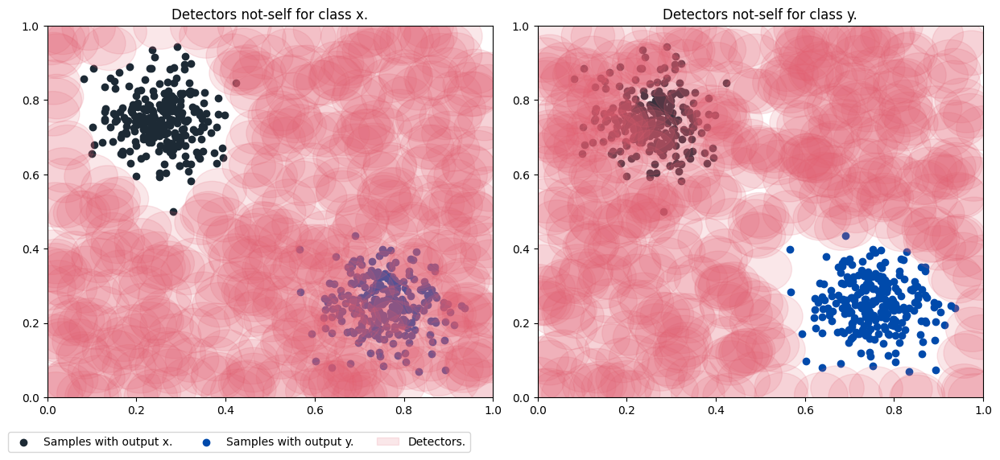
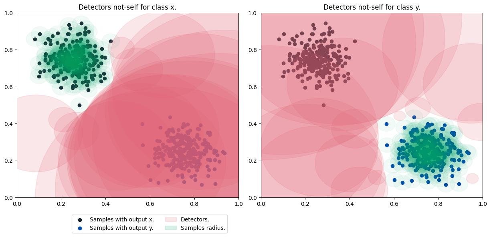

# Using the RNSA

Access the Jupyter notebook with the code available [here](https://github.com/AIS-Package/aisp/blob/main/examples/RNSA/example_with_randomly_generated_dataset-en.ipynb)!

### Importing the Real-Valued Negative Selection Algorithm.
```python
from aisp.nsa import RNSA
```

### Generating dice bubbles for classes randomly.

Using the `make_blobs` function, two sets of data are generated in the form of bubbles, in the range between 0 and 1, representing each class x and y. Then this data is separated into test and training sets.

```python
from sklearn.datasets import make_blobs
from sklearn.model_selection import train_test_split

# Generating the samples and outputs for the training.
samples, output = make_blobs(n_samples=500 , n_features=2, cluster_std=0.07, center_box=([0.0, 1.0]), centers=[[0.25, 0.75], [0.75, 0.25]], random_state=1234) 
# Separating data for training and testing.
train_x, test_x, train_y, test_y = train_test_split(samples, output, test_size=0.2)
```

---

### Testing the model `default-NSA`:

Start the model with 500 detectors, each with a radius of 0.06. Then, it presents the result of the forecast accuracy.

```python
from sklearn.metrics import confusion_matrix, classification_report, accuracy_score

# Starting the class.
model = RNSA(N=500, r=0.05, seed=1234)
# Carrying out the training:
model.fit(X=train_x, y=train_y)
# Previewing classes with test samples.
prev_y = model.predict(test_x)
# Showing the accuracy of predictions for actual data.
print(f"The accuracy is {accuracy_score(prev_y, test_y)}")
print(classification_report(test_y, prev_y))
```

Output:
```bash
✔ Non-self detectors for classes (0, 1) successfully generated:  ┇██████████┇ 1000/1000 detectors
The accuracy is 1.0
              precision    recall  f1-score   support

           0       1.00      1.00      1.00        55
           1       1.00      1.00      1.00        45

    accuracy                           1.00       100
   macro avg       1.00      1.00      1.00       100
weighted avg       1.00      1.00      1.00       100
```

---

### Detector and sample plotting:



---

### Testing the model `V-detector`:

Start the model with 50 detectors, where the minimum radius is 0.05 and the sample's own radius is 0.04. It then shows the forecast accuracy result.

```python
from sklearn.metrics import confusion_matrix, classification_report, accuracy_score

# Starting the class.
model = RNSA(N=20, r=0.02, algorithm='V-detector', r_s=0.04, seed=123)
# Carrying out the training:
model.fit(X=train_x, y=train_y)
# Previewing classes with test samples.
prev_y = model.predict(test_x)
# Showing the accuracy of predictions for actual data.
print(f"The accuracy is {accuracy_score(prev_y, test_y)}")
print(classification_report(test_y, prev_y))
```

Output:
```bash
✔ Non-self detectors for classes (0, 1) successfully generated:  ┇██████████┇ 40/40 detectors
The accuracy is 1.0
              precision    recall  f1-score   support

           0       1.00      1.00      1.00        55
           1       1.00      1.00      1.00        45

    accuracy                           1.00       100
   macro avg       1.00      1.00      1.00       100
weighted avg       1.00      1.00      1.00       100
```

---

### Detector and sample plotting:
