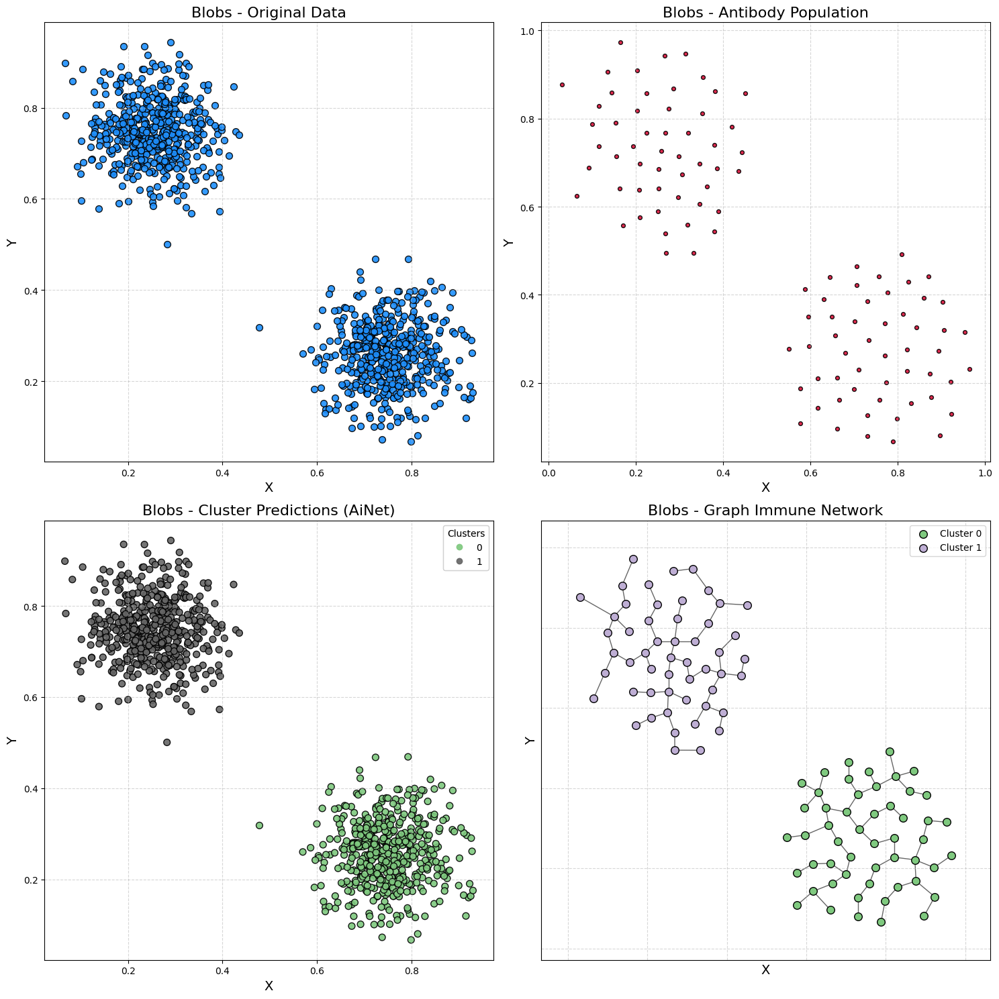
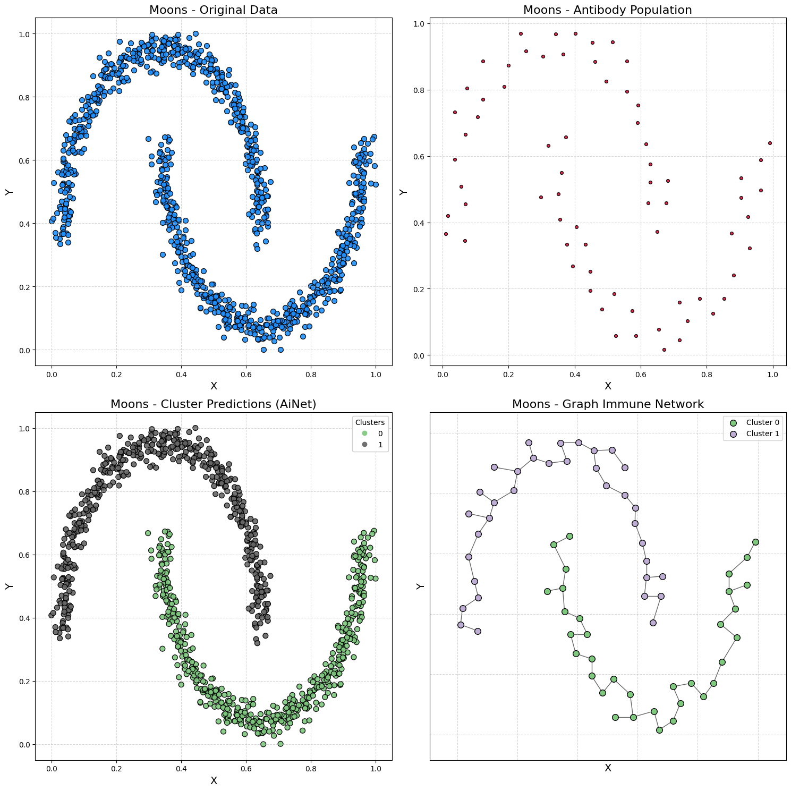
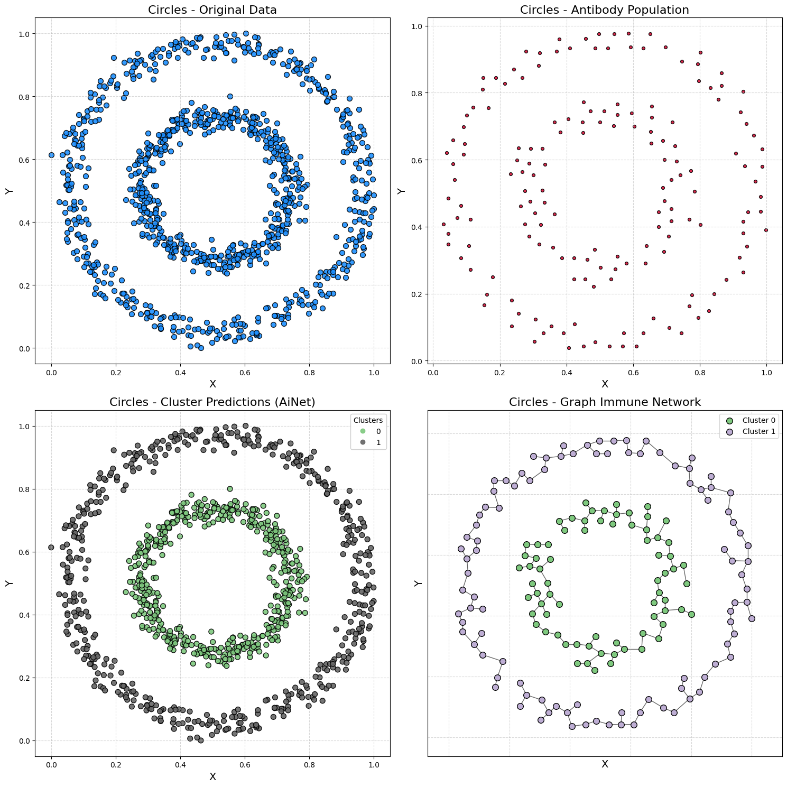

# Using the AiNet

Access the Jupyter notebook with the code available [here](https://github.com/AIS-Package/aisp/blob/main/examples/en/clustering/AiNet/example_with_randomly_generated_dataset.ipynb)!

Run notebook online via Binder: [](https://mybinder.org/v2/gh/AIS-Package/aisp/HEAD?labpath=%2Fexamples%2Fen%2Fclustering%2FAiNet%2Fexample_with_randomly_generated_dataset.ipynb)

## Introduction

Clustering is an unsupervised machine learning task that groups data into clusters.

In this notebook, we explore **AiNet (Artificial Immune Network)**. AiNet uses concepts such as antibody affinity and clone suppression to identify cluster centers.

**Objective:** Demonstrate AiNet on random datasets:

* **Blobs:** Well-defined spherical clusters.
* **Moons:** Non-linear clusters.
* **Circles:** Two concentric circles, showing non-linear separation.

**Notebook Structure:**

* Setup: Install and import libraries.
* Visualization Function: Plot AiNet results.
* Demonstration 1 - Blobs
* Demonstration 2 - Moons
* Demonstration 3 - Circles

---

## Importing the Artificial Immune Network
```python
from aisp.ina import AiNet
```

---

## Visualization Function

<details>
<summary>AiNet Visualization Function (plots clusters and immune network)</summary>

```python
def plot_immune_network(train_x, predict_y, model, title_prefix=""):
    """
    Plots the clustering results of AiNet.

    Parameters:
        train_x (np.array): Input data.
        predict_y (np.array): Cluster predictions from the model.
        model (AiNet): The trained AiNet model.
        title_prefix (str, optional): A prefix for the plot titles.
    """
    clusters = list(model._memory_network.values())
    network = np.array(model._population_antibodies)
    
    fig, axs = plt.subplots(2, 2, figsize=(15, 15))
    colors = colormaps.get_cmap('Accent')

    # Original data
    axs[0][0].scatter(train_x[:, 0], train_x[:, 1], color='dodgerblue', alpha=0.9, s=50, marker='o', edgecolors='k')
    axs[0][0].set_title(f'{title_prefix}Original Data', fontsize=16)
    axs[0][0].set_xlabel('X', fontsize=14)
    axs[0][0].set_ylabel('Y', fontsize=14)
    axs[0][0].grid(True, linestyle='--', alpha=0.5)

    # Antibody population
    axs[0][1].scatter(network[:, 0], network[:, 1], color='crimson', alpha=0.9, s=70, marker='.', edgecolors='k')
    axs[0][1].set_title(f'{title_prefix}Antibody Population', fontsize=16)
    axs[0][1].set_xlabel('X', fontsize=14)
    axs[0][1].set_ylabel('Y', fontsize=14)
    axs[0][1].grid(True, linestyle='--', alpha=0.5)

    # Cluster predictions
    scatter = axs[1][0].scatter(train_x[:, 0], train_x[:, 1], c=predict_y, cmap='Accent', s=50, edgecolors='k', alpha=0.9)
    axs[1][0].set_title(f'{title_prefix}Cluster Predictions (AiNet)', fontsize=16)
    axs[1][0].set_xlabel('X', fontsize=14)
    axs[1][0].set_ylabel('Y', fontsize=14)
    axs[1][0].grid(True, linestyle='--', alpha=0.5)
    legend1 = axs[1][0].legend(*scatter.legend_elements(), title="Clusters")
    axs[1][0].add_artist(legend1)

    # Immune Network Graph
    G = nx.Graph()
    positions = {}
    for i, cluster in enumerate(clusters):
        cluster_nodes = [f'{i}_{j}' for j in range(len(cluster))]
        G.add_nodes_from(cluster_nodes)
        for node, point in zip(cluster_nodes, cluster):
            positions[node] = tuple(point)
        dist_matrix = squareform(pdist(cluster))
        mst_local = minimum_spanning_tree(dist_matrix).toarray()
        for row_idx, row in enumerate(mst_local):
            for col_idx, weight in enumerate(row):
                if weight > 0:
                    G.add_edge(cluster_nodes[row_idx], cluster_nodes[col_idx], weight=weight)
    for i, cluster in enumerate(clusters):
        cluster_nodes = [f'{i}_{j}' for j in range(len(cluster))]
        nx.draw_networkx_nodes(G, positions, nodelist=cluster_nodes, ax=axs[1][1],
                               node_color=[colors(i)], node_size=70, edgecolors='k', label=f'Cluster {i}')
    nx.draw_networkx_edges(G, positions, ax=axs[1][1], alpha=0.6)
    axs[1][1].set_title(f'{title_prefix}Graph Immune Network', fontsize=16)
    axs[1][1].set_xlabel('X', fontsize=14)
    axs[1][1].set_ylabel('Y', fontsize=14)
    axs[1][1].grid(True, linestyle='--', alpha=0.5)
    axs[1][1].legend()
    plt.tight_layout()
    plt.show()
```

</details>

---

## Demonstration 1 - Blobs Dataset

### Generating data

```python
samples, output = make_blobs(
    n_samples=1000,
    cluster_std=0.07,
    center_box=(0.0, 1.0),
    centers=[[0.25, 0.75], [0.75, 0.25]],
    random_state=1234,
)
```

### Training AiNet

```python
model = AiNet(suppression_threshold=0.96, affinity_threshold=0.95, mst_inconsistency_factor=3, seed=123)
predict_y = model.fit_predict(samples)
```

Output:
```bash
✔ Set of memory antibodies for classes (0, 1) successfully generated | Clusters: 2 | Population of antibodies size: 104:  ┇██████████┇ 10/10 total training interactions
```

### Silhouette score

```python
silhouette = silhouette_score(samples, predict_y)
print(f"Silhouette Coefficient: {silhouette:.3f}")
```

Output:
```bash
Silhouette Coefficient: 0.826
```

### Visualization

```python
plot_immune_network(samples, predict_y, model, title_prefix="Blobs - ")
```



---

## Demonstration 2 - Moons Dataset

### Generating data

```python
samples, output = make_moons(n_samples=1000, noise=0.05, random_state=42)
samples = MinMaxScaler().fit_transform(samples)
```

### Training AiNet

```python
model = AiNet(suppression_threshold=0.95, affinity_threshold=0.97, mst_inconsistency_factor=2.5, seed=123)
predict_y = model.fit_predict(samples)
```

Output:
```bash
✔ Set of memory antibodies for classes (0, 1) successfully generated | Clusters: 2 | Population of antibodies size: 69:  ┇██████████┇ 10/10 total training interactions
```

### Silhouette score

```python
silhouette = silhouette_score(samples, predict_y)
print(f"Silhouette Coefficient: {silhouette:.3f}")
```

Output:
```bash
Silhouette Coefficient: 0.398
```

### Visualization

```python
plot_immune_network(samples, predict_y, model, title_prefix="Moons - ")
```



---

## Demonstration 3 - Circles Dataset

### Generating data

```python
samples, output = make_circles(n_samples=1000, noise=0.05, factor=0.5, random_state=42)
samples = MinMaxScaler().fit_transform(samples)
```

### Training AiNet

```python
model = AiNet(suppression_threshold=0.97, affinity_threshold=0.98, mst_inconsistency_factor=3.8, seed=123)
predict_y = model.fit_predict(samples)
```

Output:
```bash
✔ Set of memory antibodies for classes (0, 1) successfully generated | Clusters: 2 | Population of antibodies size: 169:  ┇██████████┇ 10/10 total training interactions
```

### Silhouette score

```python
silhouette = silhouette_score(samples, predict_y)
print(f"Silhouette Coefficient: {silhouette:.3f}")
```

Output:
```bash
Silhouette Coefficient: 0.112
```
### Visualization

```python
plot_immune_network(samples, predict_y, model, title_prefix="Circles - ")
```


